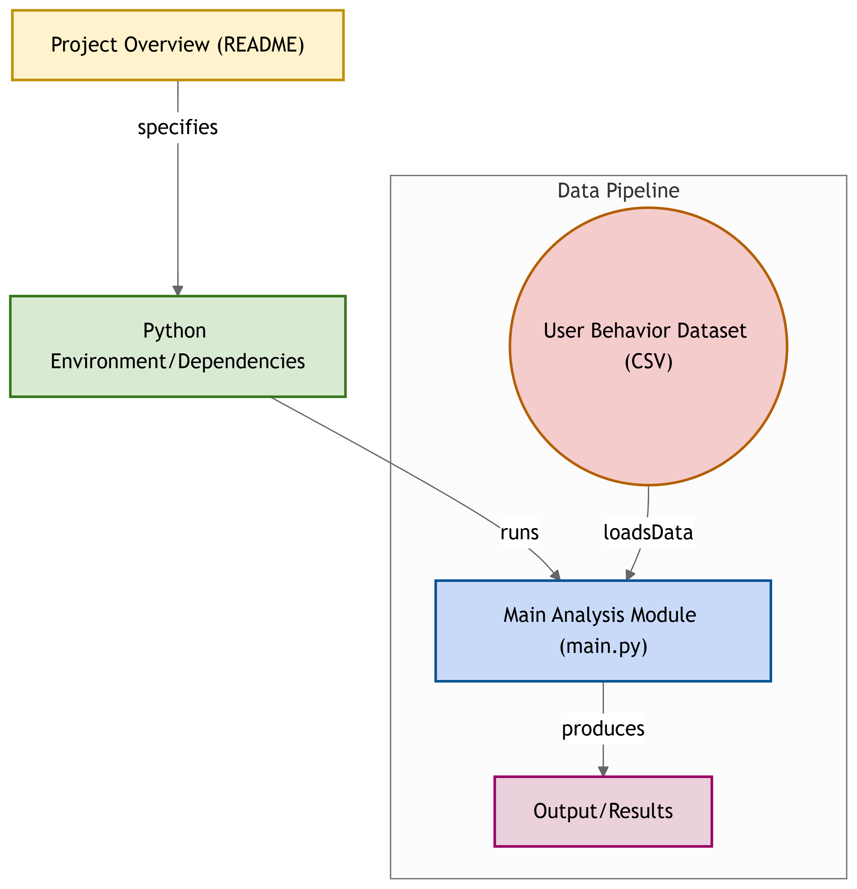

# User Behavior Based on Mobile Usage

## 📌 Project Overview
  This project analyzes user behavior patterns based on mobile usage data. By examining various features from the dataset, we aim to gain insights into user activities and preferences.

## 📂 Project Structure
  - **`main.py`**:  The primary script that loads the dataset and performs analysis.
  - **`user_behavior_dataset.csv`**: The dataset containing user behavior data.

## 📊 Dataset
  The project utilizes the `user_behavior_dataset.csv` file, which contains data on user interactions with mobile devices. Each row represents a unique user, and the columns capture various aspects of their mobile usage.

## 🚀 How to Run the Project
  1. *Clone the Repository*
     ```bash
        git clone https://github.com/avinashrkrk/user-behavior-based-on-mobile-usage.git
  2. *Navigate to the folder*
     ```bash
        cd user-behavior-based-on-mobile-usage
  3. *Install Dependencies*
     ```bash
       pip install -r requirements.txt
  4. *Execute the main script*
     ```bash
       python main.py
## Flow Diagram

